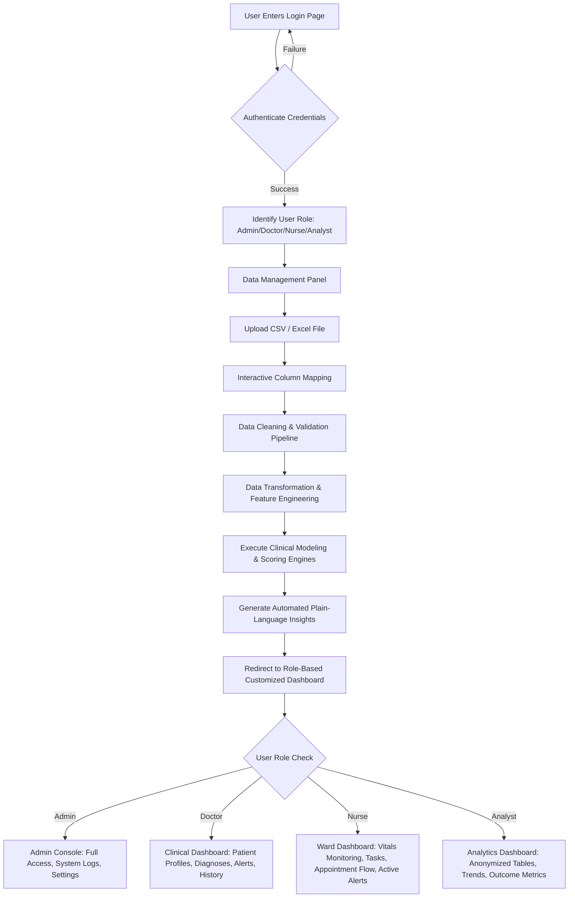

# PulseFlow: Clinical & Operational Healthcare Analytics System
## Project Specification & Architecture Design

This document serves as the comprehensive design blueprint and technical specification for **PulseFlow**, an interactive clinical and operational healthcare analytics dashboard. This blueprint is structured to support a realistic, professional-grade student project, offering clear implementation pathways from simple mock systems to advanced production-like web applications.

---

## 1. Project Title
**PulseFlow: Clinical & Operational Healthcare Analytics System**

---

## 2. Project Objective
To design and build a secure, responsive, and role-based healthcare analytics application that empowers clinical and administrative teams to ingest raw Electronic Health Record (EHR) spreadsheets, perform automated data cleaning and structural mapping, execute clinical risk calculations (e.g., readmission odds, early deterioration alerts), and explore insights via interactive dashboards tailored to four distinct organizational roles (Admin, Doctor, Nurse, Analyst).

---

## 3. Full Workflow Explanation

PulseFlow implements an end-to-end data lifecycle. The user cannot access the interactive dashboards until data is successfully ingested, cleaned, and modeled. 



### Workflow Phase Details
1. **Authentication (Login):** Evaluates user credentials, sets session tokens, enforces security policies (idle timeouts), and binds the user to a specific operational role.
2. **Data Upload & Field Mapping:** Solves the "dirty data format" issue by allowing users to upload their own CSV/Excel files and manually mapping their spreadsheet headers to the system's expected schema (e.g., mapping `pt_dob` to `Date_of_Birth`).
3. **Data Cleaning:** Clears out corrupt inputs, flags missing values in essential fields (like `Patient_ID`), removes duplicate visits, and standardizes formats (such as converting different date formats into `YYYY-MM-DD`).
4. **Data Transformation:** Calculates complex, derived variables (e.g., calculating Patient Age from Date of Birth, grouping ages into cohorts, computing length of stay, and formatting clinical states).
5. **Data Exploration:** Performs preliminary calculations (mean, standard deviations, distributions) to display data-integrity summaries and detect severe out-of-range anomalies before passing data to the visualization layers.
6. **Data Modeling:** Scores each patient records using simplified clinical risk models, calculating Readmission Risk Indexes and Early Warning Scores (NEWS2).
7. **Insight Generation:** Uses rules-based heuristics and automated data scans to generate clear, plain-language clinical and operational warnings (e.g., "Critical: Outpatient readmission rates in Cardiology have spiked by 12%").
8. **Interactive Dashboard Navigation:** Unlocks the visual UI. The sidebar, charts, panels, and data visibility adjust dynamically depending on the user's role.

---

## 4. Login Page Design & Role-Based Access Control (RBAC)

The login screen must balance strict clinical security with usability. It is designed around the principle of **Least Privilege**.

```
+-------------------------------------------------------------------+
|                            PulseFlow                              |
|                   CLINICAL ANALYTICS PLATFORM                     |
+-------------------------------------------------------------------+
|                                                                   |
|   [ Username/Email ]                                              |
|   [ Password     (o) ]                 [ Forgot Password? ]       |
|                                                                   |
|   Select Role Context:                                            |
|   ( ) Administrator   ( ) Doctor   ( ) Nurse   ( ) Data Analyst   |
|                                                                   |
|   [        L O G I N        ]                                     |
|                                                                   |
+-------------------------------------------------------------------+
|  System Security: Multi-Factor Authentication Simulation Active   |
+-------------------------------------------------------------------+
```

### User Roles & Permission Matrices

| Feature/Module | Admin | Doctor | Nurse | Analyst | Why This RBAC Matrix is Crucial |
| :--- | :---: | :---: | :---: | :---: | :--- |
| **System Settings & User Logs** | Yes | No | No | No | Only administrators should configure integration APIs or view access logs to maintain compliance. |
| **Full Clinical History & Notes**| Yes | Yes | No | No | Doctor notes contain diagnostic reasoning; nurses focus on vitals and care flow, while analysts do not need narrative logs. |
| **Vitals & Care Plan Checklist** | Yes | Yes | Yes | No | Clinical staff need real-time vitals to administer bedside care; analysts look at historical aggregates. |
| **Unmasked Patient PII** | Yes | Yes | Yes | No | Analysts must work with anonymized profiles to comply with patient privacy regulations (e.g., HIPAA). |
| **Raw File Upload & Ingestion** | Yes | Yes | No | Yes | Restricts database modification permissions to administrative and research personnel. |
| **Predictive Modeling Setup** | Yes | No | No | Yes | Adjusting model hyper-parameters or scoring algorithms is restricted to analysts and system admins. |

### Technical Security Features
- **Forgot Password Simulation:** A secure flow that validates user emails, simulates sending a 6-digit one-time password (OTP), and forces password reset with complexity checks (e.g., minimum 8 characters, capital letter, special character).
- **Session Timeout Guard:** A background process tracks user interactions (mouse movement, keystrokes). 
  - *At 10 minutes:* Triggers a subtle warning banner: *"Your session will expire in 5 minutes due to inactivity. [Stay Logged In]"*.
  - *At 15 minutes:* Destroys session variables, clears cookies/local storage, and redirects the user to the login screen with a notice: *"Session timed out due to inactivity."*
- **Dynamic PII Masking:** When the logged-in role is `Analyst`, a filter utility runs over all output data tables. 
  - *Patient Name* becomes `J*** S***` or `Patient 4821`
  - *Contact Info* and *Emergency Contact* are completely hidden (`[HIDDEN FOR PRIVACY]`).
  - *Patient ID* is hashed or displays only the first three and last two characters.

---

## 5. Data Upload & Data Preparation Pipeline Design

The system must guide the user step-by-step through a validation funnel, preventing raw data errors from breaking downstream visualization modules.

### A. The Step-by-Step Stepper Component
A horizontal progress tracker at the top of the interface:
`[1. Ingestion] =======> [2. Schema Mapping] =======> [3. Clean & Validate] =======> [4. Model Run] =======> [5. Ready]`

### B. Interactive Header Mapping (Data Mapper)
When a user uploads a spreadsheet, the system reads the header row and opens the Mapper UI.
- The user must match their source file headers (e.g., `PatientID`, `PatAge`, `Systolic`) with the standard Target Fields.
- Includes a **Smart Suggestion Engine**: If a source header matches common variants (e.g., `dob`, `birth_date`, `birthdate`), the system auto-selects the target field `Date_of_Birth`.

```
Target Field (Expected)        Uploaded Column Header (Source)      Status
[ Patient ID       [*] ] <--- [ pat_id                 [v] ]    [ Mapped (Auto)  ]
[ Full Name        [*] ] <--- [ patient_fullname       [v] ]    [ Mapped (Fuzzy) ]
[ Systolic BP      [ ] ] <--- [ bp_sys                 [v] ]    [ Mapped (Manual)]
[ Admission Date   [*] ] <--- [ Select Column...       [v] ]    [ REQUIRED FIELD ]
```

### C. Validation & Cleaning Engine rules
When the user clicks "Execute Clean", the following functions are run:
1. **De-duplication:** Identifies identical rows matching on `Patient_ID` + `Admission_Date` + `Visit_ID`. It prompts the user to select whether to keep the first, keep the last, or reject duplicates.
2. **Missing Values Handler:**
   - Critical columns (`Patient_ID`, `Admission_Date`, `Diagnosis`): Imputes placeholder or rejects the row, logging it to an Error Dashboard.
   - Clinical columns (`Vitals`, `Lab_Results`): Replaces nulls with calculated column medians or normal baselines and adds a warning flag column (e.g., `Systolic_BP_Imputed = true`).
3. **Format Standardizer:**
   - Date formats (`MM/DD/YYYY`, `DD-MM-YYYY`, `YYYY.MM.DD`) are standardized to ISO 8601 (`YYYY-MM-DD`).
   - Text standardizer: Collapses casing and trailing spaces (e.g., `" cardiology"`, `"Cardio"`, `"CARDIOLOGY"` all become `"Cardiology"`).
4. **Out-of-Bounds Inspector:** 
   - Age check: Outliers like negative ages or ages > 115 are flagged.
   - Vitals verification: BP > 300 or < 30, Heart Rate > 250 or < 20 are flagged as potential equipment errors.

### D. Dataset Operations
- **Refresh/Replace:** Cleans the existing state and writes the new dataset as the current active session data.
- **Append:** Matches the incoming schema with the existing database. If a record matches a previous `Patient_ID` and `Admission_Date`, it updates it (upsert); otherwise, it appends it.

---

## 6. Comprehensive Feature List (With Utility Explanations)

This list explains the primary capabilities built into PulseFlow and why they are necessary for healthcare analytics.

1. **Role-Based Views (RBAC)**
   - *Why it is useful:* Protects patient privacy, prevents information overload for bedside staff, and prevents administrative files from cluttering clinical interfaces.
2. **Dynamic Spreadsheet Mapping Pipeline**
   - *Why it is useful:* Allows the dashboard to work with records exported from different clinic databases (e.g., Epic, Cerner, or custom spreadsheets) without requiring manual re-typing.
3. **Data Cleaning Log & Verification Panel**
   - *Why it is useful:* Gives the user transparency over how many errors were fixed automatically and lets them review rows that were rejected due to severe errors.
4. **NEWS2 Clinical Modeling (Early Warning System)**
   - *Why it is useful:* Automatically calculates risk scores to flag patients who might be deteriorating, allowing early clinical intervention.
5. **Readmission Risk Estimator**
   - *Why it is useful:* Helps hospital managers identify patients who need detailed follow-up care before they are discharged, helping to reduce expensive hospital readmissions.
6. **Patient Profile Explorer**
   - *Why it is useful:* Lets doctors and nurses drill down into a single patient's history, timeline, and vitals to make informed clinical decisions.
7. **Side-by-Side Patient Comparison Drawer**
   - *Why it is useful:* Helps clinical teams compare patients with similar conditions to evaluate how they respond to different treatments.
8. **Real-time Abnormal Alert System**
   - *Why it is useful:* Instantly alerts the care team when critical vitals or lab results go outside safe ranges.
9. **Multi-Format Export Engine (CSV/Excel/PDF)**
   - *Why it is useful:* Allows clinicians to export summaries for shift handovers and enables analysts to pull cleaned datasets for external statistical software.
10. **Dual Theme Engine (Light/Dark Mode)**
    - *Why it is useful:* Reduces eye strain for medical staff working night shifts in dark wards, ensuring screen legibility in all lighting conditions.

---

## 7. Recommended Dashboard Sections

The dashboard is structured into logical modules to keep the interface clean and easy to read.

### A. Patient Summary Strip (KPI Cards)
- **Total Patient Intake:** Cumulative counts of patients processed.
- **Active Bed Occupancy:** Inpatients currently assigned to a ward bed.
- **Outpatient Volume:** Patients seen in clinics without overnight stays.
- **High-Risk Alerts:** Number of current patients flagged with severe clinical risk.
- **Discharge Pending:** Patients scheduled for discharge within 24 hours.

### B. Safety Indicators & Abnormal Alerts Grid (High Priority)
- Displays active cards with flashing amber or red borders:
  - **Allergy Flags:** Lists severe reactions (e.g., Penicillin, Latex) for active patients.
  - **Critical Vitals:** Red warning cards for heart rate (>120 or <50 bpm), oxygen levels (<92%), or severe fever (>103°F).
  - **Missed Medications:** Shows checklist tasks that are overdue by more than 60 minutes.

### C. Clinical Status & Condition Metrics
- **Medication Adherence Monitor:** Average patient compliance percentage.
- **Chronic Disease Distribution:** Breakdown of long-term conditions (Diabetes, Hypertension, COPD, Asthma) to support population health management.
- **Treatment Milestone Progress:** Gauges showing the percentage of patients meeting their recovery pathway milestones.

### D. Operational & Bed Utilization Metrics
- **Average Length of Stay (LOS):** Tracks the average days spent in the hospital.
- **30-Day Readmission Rate:** The percentage of patients returning within a month.
- **Emergency Department (ED) Transition Times:** The average hours a patient spends in the ED before being admitted to a ward.

### E. Interactive Patient Cohorts Table
- A filterable table showing active patients, demographics, admitting doctor, department, current risk level, and primary diagnosis.
- Clicking any patient row opens the **Patient Profile** panel.

### F. Patient Profile Page / Detail View
- Displays a dedicated workspace for a single patient:
  - **Header:** Demographics, medical record number (MRN), active allergies, and quick vitals badges.
  - **Tab 1: History & Notes:** Chronological clinical narratives written by doctors.
  - **Tab 2: Vitals Charts:** Longitudinal line charts tracking blood pressure, heart rate, and oxygen levels.
  - **Tab 3: Medications:** A checklist of active, scheduled, and completed medications.
  - **Tab 4: Care Team:** Contact details for the primary physician, attending nurse, and next of kin.

---

## 8. Recommended Charts for Each Section

Choose clean, uncluttered visual representations optimized for quick decision-making:

```
+---------------------------------------------------------------------------------------+
|  CHART RECOMMENDATIONS & MAPPINGS                                                     |
+---------------------------------------------------------------------------------------+
|  Section                  | Chart Type              | Variable Mappings               |
+---------------------------+-------------------------+---------------------------------+
|  Intake Trends            | Area / Line Chart       | X: Month/Day                    |
|                           | (Smooth Curves)         | Y: Admissions vs. Discharges    |
|                           |                         |                                 |
|  Diagnosis Profiles       | Horizontal Bar Chart    | X: Count of Patient Visits      |
|                           | (Sorted Descending)     | Y: ICD-10 Category Name         |
|                           |                         |                                 |
|  Utilization Metrics      | Dual Axis Line + Column | Column Y1: Admission Counts     |
|                           |                         | Line Y2: Average Length of Stay |
|                           |                         |                                 |
|  Risk & Age Correlation   | Bubble Scatter Plot     | X: Age, Y: Calculated Risk Score|
|                           |                         | Bubble Size: Medication Adher.% |
|                           |                         | Bubble Color: Risk Tier         |
|                           |                         |                                 |
|  Vitals Longitudinal      | Multi-line Chart        | X: Attending Time / Date        |
|                           | with Normal Bands       | Y: Temperature / SpO2 / Pulse   |
|                           |                         | Background: Normal Range (Grey) |
|                           |                         |                                 |
|  Outcome Metrics          | Semi-circle Radial Gauge| Value: Treatment Adherence %    |
|                           |                         | Color: Green (>80), Orange, Red |
|                           |                         |                                 |
|  Bed Occupancy Breakdown  | Treemap Chart           | Box Area: Department Beds Filled|
|                           |                         | Box Color: Risk Concentration  |
+---------------------------+-------------------------+---------------------------------+
```

---

## 9. Suggested Layout Structure

Here is a visual wireframe of the layout grid, designed to look modern, clean, and balanced.

```
+---------------------------------------------------------------------------------------------+
| [PulseFlow Logo]  [Quick Search Patients/Doctors...]                (Theme: L/D)  [Nurse Joy (v)] |
+---------------------------------------------------------------------------------------------+
| (o) Dashboard   |  FILTERS: [Date Range  [v]] [Department [v]] [Risk Tier [v]] [Apply Filters]    |
| ( ) Ingestion   +---------------------------------------------------------------------------+
| ( ) Exploration |  [ KPI: Inpatients ]  [ KPI: Emergency ]  [ KPI: Critical ]  [ KPI: Avg Stay ]  |
| ( ) Profiles    |  |  84 Active Beds |  |  12 Waiting    |  |   5 Patients  |  |   4.2 Days    |  |
| ( ) Comparison  +---------------------------------------------------------------------------+
| ( ) Settings    |  [ CRITICAL ALERTS PANEL (Flashing) ]                                      |
|                 |  * ALERT: Patient John Doe (Ward 4B) SpO2 dropped to 89% -- 2 mins ago    |
|                 |  * ALERT: Patient Sarah Lee (Ward 1A) Heart Rate: 135 bpm -- 8 mins ago    |
|                 +----------------------------------------------------+----------------------+
|                 |  [ LINE: Monthly Intake & Readmission Trends ]     | [ BAR: Diagnosis ]   |
|                 |  120 |       /\                                    | Cardiology [======]  |
|                 |  100 |  /\  /  \  Admissions                       | Pulmonology[====]    |
|                 |   80 | /  \/    \                                  | Neurology  [==]      |
|                 |   60 |/__________\_______________________________  | Oncology   [====]    |
|                 |      Jan  Feb  Mar  Apr  May                       | Orthopedics[=]       |
|                 +----------------------------------------------------+----------------------+
|                 |  [ COHORT SEARCH & PATIENT LIST ]                                         |
|                 |  Search: [____________]  Show: [All Risks [v]] [Export CSV]                |
|                 |  ID      Name           Age   Dept         Risk Level   Vitals State      |
|                 |  P-001   Robert Chen    64    Cardiology   [ HIGH ]     Abnormal BP       |
|                 |  P-002   Elena Rostova  32    Obstetrics   [ LOW  ]     Stable            |
|                 |  P-003   Marcus Vance   78    Pulmonology  [ MED  ]     Low Oxygen        |
|                 +---------------------------------------------------------------------------+
|                 |  Insights: Ward 4B currently has the highest concentration of high-risk    |
|                 |  patients. Average length of stay has increased by 0.5 days since Monday. |
+-----------------+---------------------------------------------------------------------------+
```

---

## 10. Healthcare Data Model & Suggested Fields

The following fields represent a comprehensive, clinical dataset structure that your system should support:

| Field Key (Standard ID) | UI Display Name | Data Type | Validation & Range Rules | Description / Purpose |
| :--- | :--- | :--- | :--- | :--- |
| `Patient_ID` | Patient ID | String (Key) | Unique regex: `^PT-\d{5}$` | The unique identifier for the patient. |
| `First_Name` | First Name | String | Not Empty | Patient's first name. |
| `Last_Name` | Last Name | String | Not Empty | Patient's last name. |
| `Date_of_Birth` | Date of Birth | Date | YYYY-MM-DD; must be in the past | Used to calculate dynamic age. |
| `Gender` | Gender | Category | `Male`, `Female`, `Other`, `Unknown` | Patient demographic gender. |
| `Admission_Date` | Admission Date | Date | YYYY-MM-DD; $\le$ Today | Tracks the start of the visit. |
| `Discharge_Date` | Discharge Date | Date | $\ge$ Admission Date or Null (Active) | Tracks the end of the visit. |
| `Department` | Attending Department| Category | `Cardiology`, `Neurology`, `Pediatrics`, `Oncology`, `Emergency`, `ICU` | Department managing the care. |
| `Attending_Doctor` | Attending Doctor | String | Not Empty | Doctor responsible for care. |
| `Primary_Diagnosis` | Primary Diagnosis | String / Code| ICD-10 standard codes or descriptors | Core illness category. |
| `Systolic_BP` | Systolic BP | Integer | $50 - 250$ mmHg | Upper blood pressure reading. |
| `Diastolic_BP` | Diastolic BP | Integer | $30 - 150$ mmHg | Lower blood pressure reading. |
| `Heart_Rate` | Heart Rate | Integer | $30 - 220$ bpm | Pulse rate. |
| `Oxygen_Saturation` | Oxygen Saturation | Integer | $50\% - 100\%$ | SpO2 levels. Normal range is $\ge 95\%$. |
| `Temperature_F` | Body Temperature | Decimal | $94.0 - 106.0$ °F | Body temperature. |
| `Med_Adherence_Pct` | Medication Adherence| Decimal | $0.0\% - 100.0\%$ | Percentage of prescribed doses taken. |
| `Readmission_Flag` | Readmitted? | Boolean | `True` / `False` | Has the patient returned within 30 days? |

---

## 11. Sample AI-Generated Clinical Insights

The analytics dashboard will automatically scan the dataset to generate plain-language summaries and action items.

- > [[IMPORTANT]]
  > **High-Risk Readmission Alert:** 
  > Patients in the *Cardiology* department aged $75+$ show a **$24\%$ readmission rate** (nearly double the clinic's $13\%$ baseline target). The data shows a strong correlation with a **Medication Adherence score below $70\%$**. 
  > *Suggested Action:* Attending staff should trigger a mandatory post-discharge home care checklist and schedule a phone follow-up within 72 hours for high-risk cardiology patients.

- > [[WARNING]]
  > **Bed Capacity & Length of Stay Bottleneck:** 
  > The *ICU* is experiencing a average Length of Stay (LOS) spike of **$8.4$ days** (normally $5.2$ days). This correlates with a $15\%$ delay in transferring patients to lower-intensity wards due to high ward occupancy. 
  > *Suggested Action:* The administrative team should review transfer protocols for stable patients in Ward 3B to free up regular beds.

- > [[NOTE]]
  > **Critical Vitals Trend:** 
  > Oxygen saturation levels in *Pulmonology Ward 4C* show a pattern of dropping below $92\%$ between the hours of **2:00 AM and 5:00 AM** for patients diagnosed with COPD. 
  > *Suggested Action:* Nurses should schedule proactive nocturnal oxygen level checks for Ward 4C during these hours.

---

## 12. Scope Definition: Simple vs. Advanced

```
+---------------------------------------------------------------------------------------------+
| SCOPE COMPARISON GRID                                                                       |
+---------------------------------------------------------------------------------------------+
| Dimension           | Simple Version (Class Project)      | Advanced Version (Professional) |
+---------------------+-------------------------------------+---------------------------------+
| Tech Stack          | - Vanilla HTML, CSS, JavaScript     | - React / Vite or Next.js       |
|                     | - Chart.js via CDN                  | - TailwindCSS & HSL custom variables|
|                     | - LocalStorage for persistence      | - Recharts or D3.js             |
|                     |                                     | - SQLite / PostgreSQL (WebSQL)  |
|                     |                                     |                                 |
| Ingestion & Mapping | - Accepts CSV format only           | - Drag-and-drop CSV / Excel     |
|                     | - Hardcoded column names            | - Dynamic column mapper         |
|                     | - Simple table view pre-upload      | - In-browser data-grid editor   |
|                     |                                     |                                 |
| Data Cleaning       | - Skips rows with missing values    | - Interactive data cleaning UI  |
|                     | - Basic string trim functions       | - Outlier detection & flags     |
|                     |                                     | - Automated median imputations  |
|                     |                                     |                                 |
| Clinical Modeling   | - Static formula:                   | - NEWS2 (National Early Warning)|
|                     |   `Risk = (Age > 70) + (BP > 140)`  | - Multivariate Logistic Regres. |
|                     | - Predicts simple High/Low risk     | - Dynamic risk classification   |
|                     |                                     |                                 |
| Patient Details     | - Shows simple alert popup          | - Full-screen Patient Profile   |
|                     | - Basic list selection              | - Interactive clinical timeline |
|                     |                                     | - Side-by-side comparison drawer|
|                     |                                     |                                 |
| Reporting & Export  | - Prints page using window.print()  | - Custom PDF report generator   |
|                     | - Simple CSV export of tables       | - Excel reports with formatting |
+---------------------------------------------------------------------------------------------+
```

---

## 13. Phased Implementation Roadmap

To build this project efficiently, tackle the features in this order:

### Phase 1: Foundations & The Core Design System
- Set up your files (`index.html`, `main.js`, `styles.css`).
- Establish global styling rules, CSS color variables for light and dark modes, and the layout container.
- Build the core navigation header and sidebar structure.

### Phase 2: User Access & Security (Login Framework)
- Design the login screen layout.
- Implement the client-side role selection state and set up the fake credential verification logic.
- Create mock user accounts representing all four roles (Admin, Doctor, Nurse, Analyst).
- Add the auto-timeout detection code and the login redirect router.

### Phase 3: Data Ingestion & Clean Pipeline
- Add the file upload drag-and-drop box.
- Implement a CSV text parser.
- Build the Field Mapper UI to map incoming headers to your standard target schema.
- Write the JavaScript cleaning rules: date standardization, duplicate removal, and vitals boundary checks.

### Phase 4: Scoring Calculations & Clinical Engine
- Write helper functions to calculate patient Age, Length of Stay, and Readmission Risk.
- Implement the clinical Early Warning Scoring system (NEWS2 classification).
- Write analytical aggregation routines to summarize diagnostic breakdowns and occupancy rates.
- Generate automated plain-text clinical and operational warnings.

### Phase 5: Dashboard Visualization & Custom RBAC Views
- Integrate a charting library (like Chart.js or Recharts).
- Build the KPI summary card strip, trend lines, and distribution charts.
- Write the access filter checks: adjust visible columns, hide patient PII for Analysts, and restrict doctor notes to clinical roles.
- Add the global filter panel (allowing users to filter by date range, department, and risk level).

### Phase 6: Patient Profile View, Comparison Drawer, & Polish
- Build the Patient Profile component to show clinical records, doctor notes, and longitudinal vitals charts.
- Implement the multi-patient selection drawer for side-by-side comparisons.
- Implement the PDF/CSV export scripts.
- Conduct final testing of the light/dark theme toggle, ensuring all pages and charts adapt visually.

---

## 14. Design System, Accessibility, & Theme Consistency

To ensure the interface feels professional and polished, use a consistent design system that supports dark mode and accessibility standard WCAG 2.1 AA/AAA.

### A. The Core Color Tokens (HSL Palette)
Define colors using HSL values. This makes it easy to create consistent light and dark modes and adjust colors dynamically.

```css
:root {
  /* Dynamic Palette Tokens (Light Theme Defaults) */
  --bg-primary: hsl(210, 20%, 98%);
  --bg-secondary: hsl(0, 0%, 100%);
  --border-color: hsl(210, 14%, 90%);
  
  --text-main: hsl(210, 24%, 16%);
  --text-muted: hsl(210, 10%, 45%);
  
  /* Clinical Theme Tones */
  --color-primary: hsl(200, 95%, 38%);    /* Medical Blue - Trustworthy */
  --color-secondary: hsl(170, 80%, 35%);  /* Clinical Teal - Calming */
  --color-success: hsl(145, 63%, 42%);    /* Stable / Discharged - Green */
  --color-warning: hsl(38, 92%, 50%);     /* Watch / Med Risk - Amber */
  --color-danger: hsl(354, 70%, 54%);     /* Critical / High Risk - Red */
  
  --shadow-sm: 0 1px 3px rgba(0,0,0,0.05);
  --shadow-md: 0 4px 6px -1px rgba(0,0,0,0.1);
}

[data-theme="dark"] {
  /* Dynamic Palette Tokens (Dark Theme Overrides) */
  --bg-primary: hsl(210, 24%, 8%);
  --bg-secondary: hsl(210, 20%, 12%);
  --border-color: hsl(210, 14%, 20%);
  
  --text-main: hsl(210, 17%, 95%);
  --text-muted: hsl(210, 8%, 70%);
  
  /* Brightened clinical tones for dark contrast */
  --color-primary: hsl(200, 90%, 50%);
  --color-secondary: hsl(170, 75%, 45%);
  --color-success: hsl(145, 60%, 50%);
  --color-warning: hsl(38, 90%, 55%);
  --color-danger: hsl(354, 80%, 60%);
}
```

### B. Accessibility & Usability Best Practices
- **Contrast Ratios:** Ensure all text-to-background contrast ratios are at least **4.5:1** for regular text and **3:1** for headings or UI borders, meeting WCAG AA requirements.
- **Colorblind-Safe Palettes:** Avoid relying *only* on red/green colors to indicate status. Always include support indicators:
  - Add text status markers alongside colors (e.g., `[CRITICAL]` or `[STABLE]`).
  - Use patterns, shapes, or icons (e.g., alert exclamation marks vs. checkmarks) in charts and logs.
- **Interactive Keyboard Controls:** 
  - Ensure all navigation buttons, filters, and list items have clear `:focus-visible` outline rings (using clinical teal outline, `3px solid var(--color-secondary)`).
  - Add `aria-label` attributes to patient detail buttons and icon-only buttons to support screen readers.

---

## 15. Final Summary of the Project

**PulseFlow** bridges raw, messy EHR data spreadsheets with a high-fidelity visual analysis interface. By guiding the user through data ingestion, column mapping, automated cleaning, and clinical calculation steps, the application models the exact steps taken in real healthcare IT pipelines. 

The application adapts dynamically for administrators, doctors, nurses, and data analysts. Key features like patient comparison views, early warning alerts, and longitudinal vitals tracking make it a realistic clinical tool. 

Whether built as a simple client-side browser dashboard or scaled up into a modern web framework, the system provides a robust foundation for learning data validation, access control, and user experience design in healthcare analytics.
